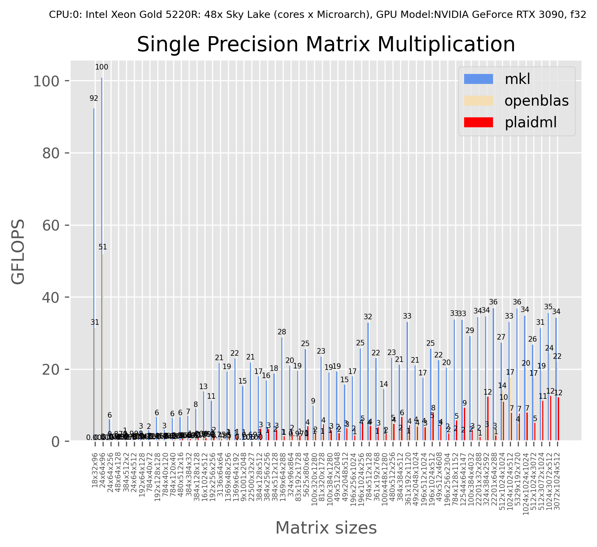
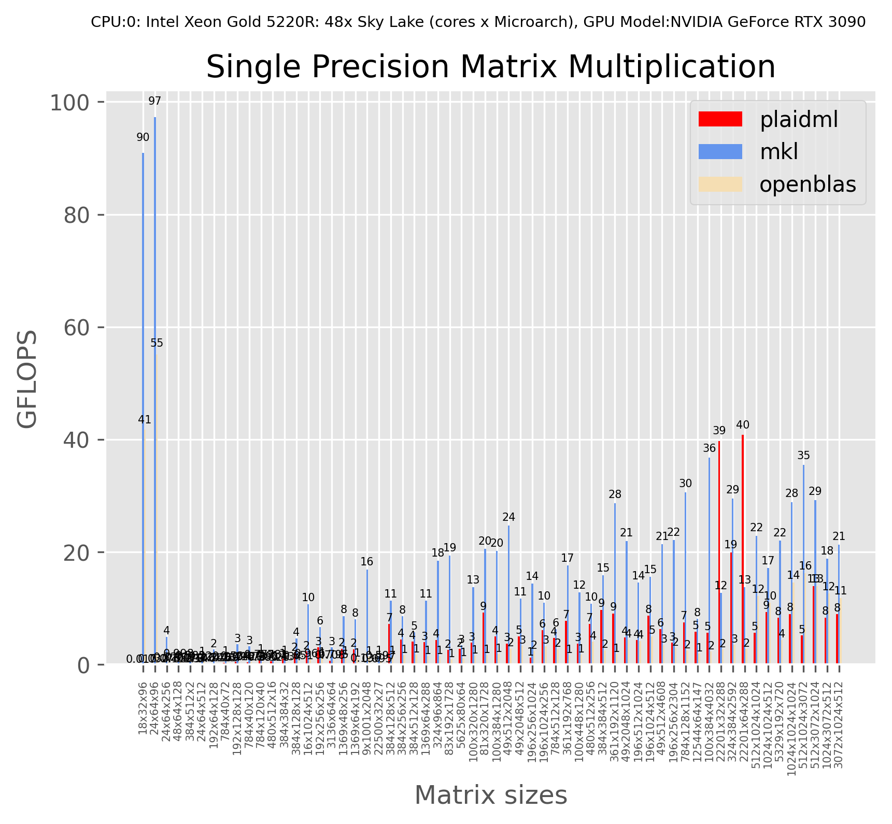

# PlaidML in mmperf

This forked repository aims to benchmark PlaidML with mmperf.

## Environment Settings

There is conflicts between the environment required by PlaidML and mmperf. I keep the mmperf environemnt setting mostly. First, create a virtual environment and install requirements. Here I choose Python 3.7 instead of Python 3.8 demanded by README in mmperf.

```
conda create -n mmperf python=3.7
conda activate mmperf
pip install -r requirements.txt
pip install -r ./external/llvm-project/mlir/python/requirements.txt
```

And install dependencies mentioned in [environments.yml](https://github.com/plaidml/plaidml/blob/plaidml-v1/environment.yml) of PlaidML. The reasons why I only select the following packages is that they did lead to errors.

```
pip install pcpp==1.20.1
pip install pystache=0.5.4
pip install cffi=1.14.4
```

## Building and Running

Below is the commands to build mmperf with backends including plaidml, OpenBLAS, mkl. The `MKL_DIR` value depends on your local setting.
```
cmake -GNinja \
    -DCMAKE_CXX_COMPILER=clang++-11 \
    -DCMAKE_C_COMPILER=clang-11 \
    -DMKL_DIR=/opt/intel/oneapi/mkl/latest/ \
    -DUSE_MKL=ON \    
    -DUSE_OPENBLAS=ON \
    -DUSE_PLAIDML=ON \
    -B build .

cmake --build build
```

To generate performance numbers and get a comparison plot run:
```
python3 mmperf.py ./build/matmul/ results
```

Each generated binary can also be executed individually. To run a specific matrix size (say 24x64x512) for a backend run:
```
./build/matmul/matmul_plaidml_24x64x512
```


## Results for GEMM

Note: Although GPU information is displayed in figure, but the execution didn't call GPU API. It can be verified by `nsys` command.



## Results for SGEMM

Note: The above result is tested with `alpha = 1` and `beta = 0` in the definition of SGEMM C = alpha * AB + beta * C. This result is tested with `alpha = 1` and `beta = 1`. 


